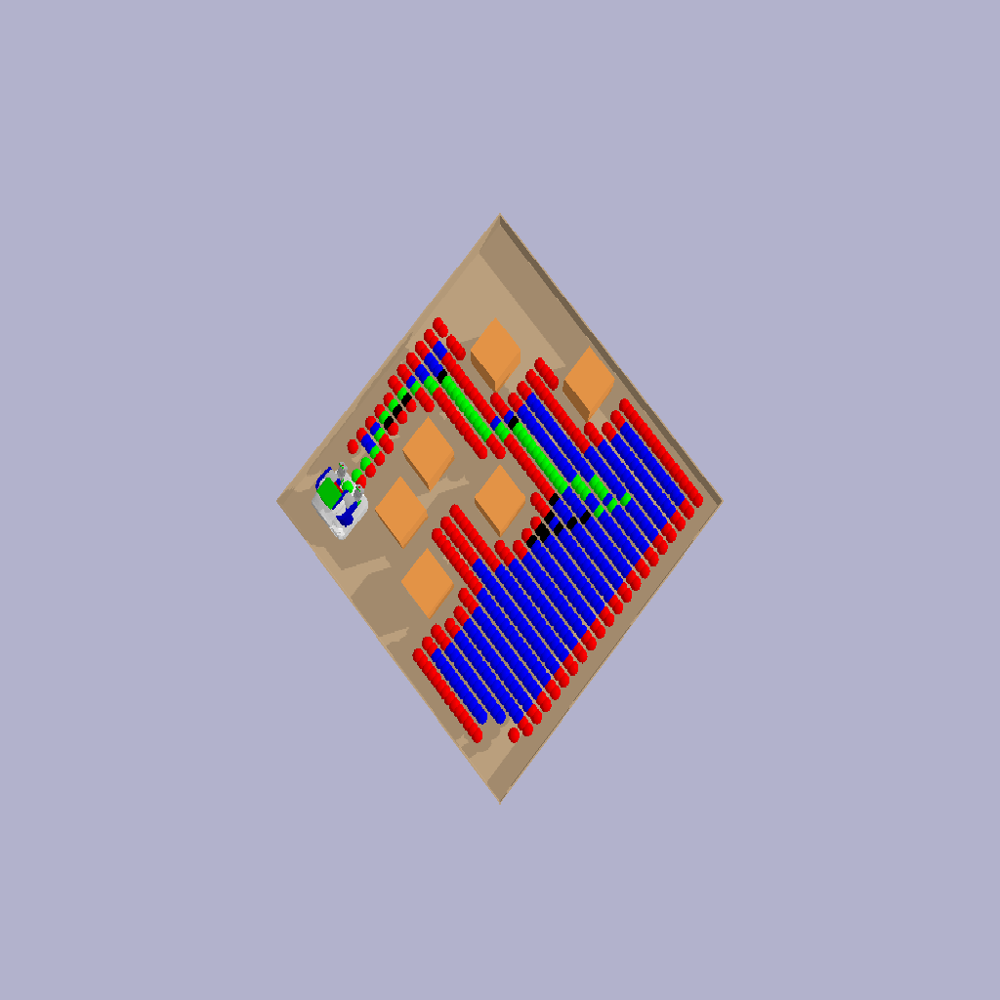
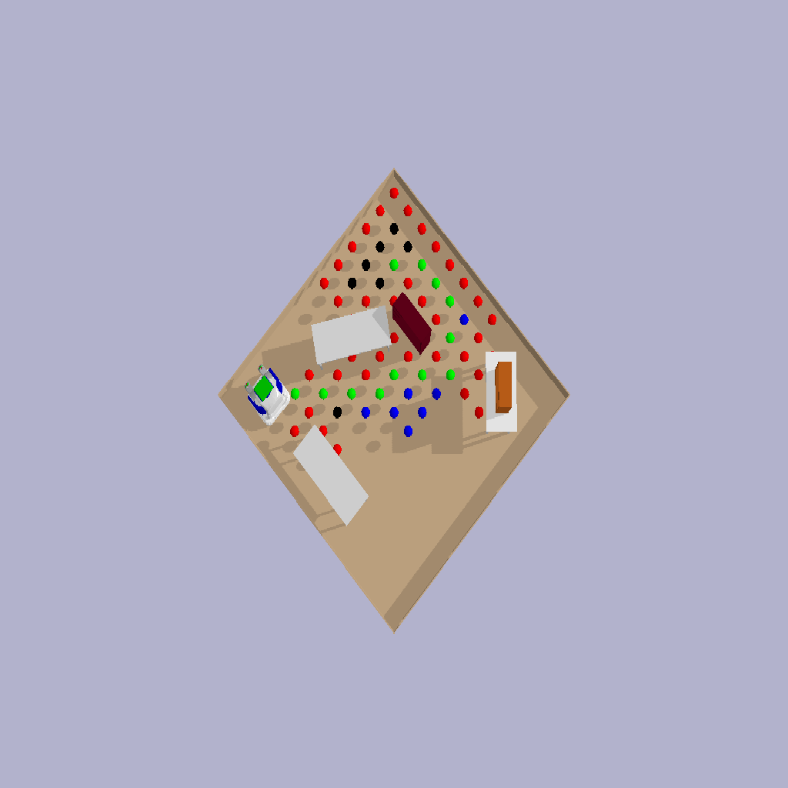

# Anytime Non-Parametric A* for PR2 Navigation with Pybullet

## Overview

This project implements the Anytime Non-Parametric A* (ANA*) algorithm for PR2 robot navigation through multiple scenes using the Pybullet physics simulation library. ANA* is a path planning algorithm that combines the advantages of A* with anytime computation, making it suitable for real-time robot navigation in dynamic environments.

In this README, we provide an overview of the project, installation instructions, and an example of how to use ANPPA* for PR2 navigation in Pybullet.

## Installation

To get started with this project, follow these steps to set up the required environment:

1. Clone the repository
```
git clone https://github.com/thirumalaesh-a/ANAStar.git
```

3. Install the required dependencies:
Pybullet
Numpy
Matplotlib
Pillow

4. Run demo using 
```
python3 demo.py
```
# Examples : Output 
### Using Heuristic: Octile, Algorithm: ANA*


### Using Heuristic: Eucledian, Algorithm: ANA*

